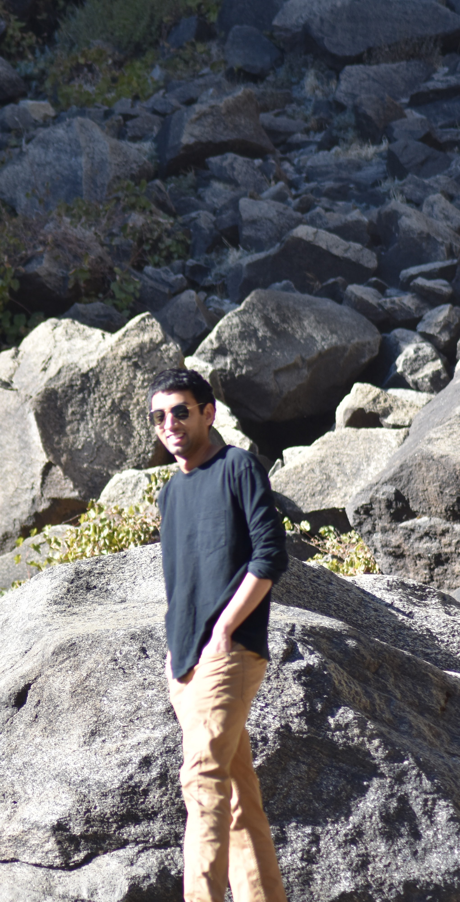

Currently, I am a post-doctoral research associate at the <a href = "https://cnls.lanl.gov/External/" target="_blank" style="text-decoration:none"> Center for Nonlinear Studies (CNLS)</a> and <a href = "https://www.lanl.gov/org/ddste/aldsc/theoretical/applied-mathematics-plasma-physics/index.php" target="_blank" style="text-decoration:none"> Applied Math & Plasma Physics </a> group in Los Alamos National Laboratory, USA. I am also a part of the <a href = "https://lanl-ansi.github.io/" target="_blank" style="text-decoration:none"> Advanced Network Science Initiative (ANSI) </a> working with <a href = "https://azlotnik.github.io/" target="_blank" style="text-decoration:none"> Anatoly Zlotnik </a> and <a href = "https://kaarthiksundar.github.io/" target="_blank" style="text-decoration:none"> Kaarthik Sundar</a>. I currently work on modeling and optimization of gas grid networks with a focus on integrating hydrogen and natural gas in existing pipeline networks. I am also interested in algorithms and applications for <b> mathematical programing with equilibrium constraints (MPECs) </b> which are used to solve optimization problems with variational inequalities.  

I obtained my PhD working with Prof. <a href = "http://numero.cheme.cmu.edu/" target="_blank" style="text-decoration:none"> Lorenz Biegler </a> in Chemical Engineering from Carnegie Mellon University, Pittsburgh in 2021. My PhD project was in developing detailed heat exchanger design models and incorporating them in large flowsheet optimization models using trust-region methods. I also worked on modeling multi-component phase change heat exchangers using MPECs in heat integration optimization models among other things.

Prior to that, I completed my Bachelors (with Honors) in Chemical Engineering (minor in Electrical Engineering) from Indian Institute of Technology Bombay in India 2016.

In my free time, I watch sports (Soccer, F1 and NFL) and listen to music (mostly Hard Rock). I also like playing soccer and hiking with friends.

 <!--

  

    
  

  

    
  

--> 

Please feel free to contact me via Email or Linkedin.
